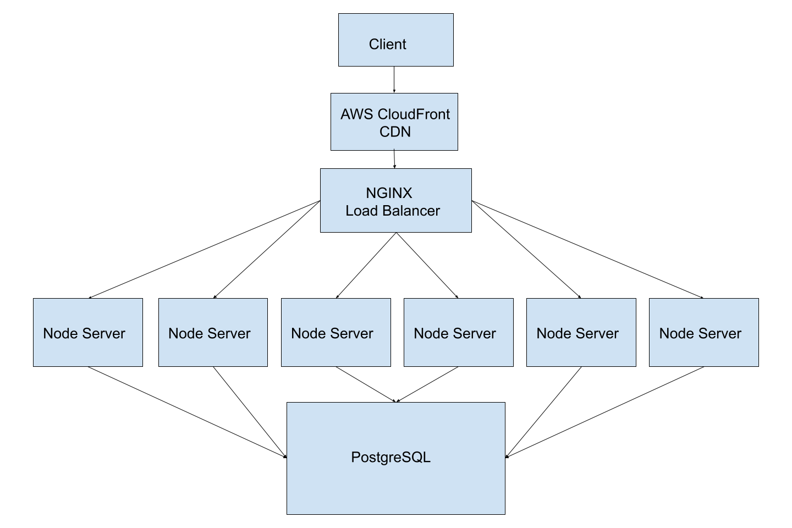

# System Design

## Overview

The intention of this project is to build a horizontally scaled back end for an
API serving a front end e-commerce store's microservice.

### Requirements

- Service must respond to over 1000 requests per second (RPS) with a sub 2%
  error rate and sub 1s response time on a database containing 30 million
  generated records.

## Final Architecture

## Key Metrics Achieved

- 1300 RPS on AWS EC2 micro instances
- 0.1% error rate

### Data Generation

Generated and wrote 30 million records to a CSV file on disk using a recursive
algorithm.

### Front End Deploy

- Statically hosted microservices across 4 AWS CloudFront CDN instances

### Load Balancing

- Used Nginx as a load balancer utilizing a least stressed server approach

### Server Hosting

- Deployed 6 Dockerized Node.js servers to AWS EC2 instances in order to reduce
  processing time
- Increased query performance and processing time through simplification of
  queries
- Increased client pool to 600 clients

### PostgreSQL

_Performance Improved using the following strategies_

- Denormalization of data for faster query times
- Indexing of keys used for search
- Partitioned data into 1 million record segments to increase speed of lookup
- Increased maximum clients in pool to 600
- Increased working memory to maximum possible on AWS EC2 micro instances

### Testing

- K6 for load testing locally and in the cloud
- New Relic for visual metrics across each node server and Post
- Loader.io for client reliability testing
